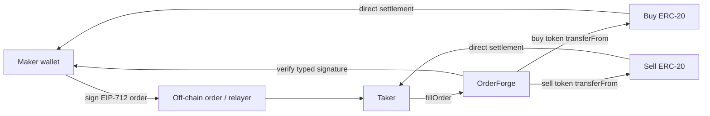

# OrderForge

[](https://github.com/alsaecas/orderforge/actions/workflows/ci.yml)
[](foundry.toml)
[](https://book.getfoundry.sh/)
[](LICENSE)

**Non-custodial EIP-712 limit-order settlement with partial fills, nonce binding, ERC-1271 support and stateful Foundry invariants.**

OrderForge turns ABI encoding and hashing concepts into a cohesive protocol rather than a collection of isolated encoder examples. A maker signs a typed order off-chain; a permitted taker settles all or part of it on-chain. The contract verifies the exact signed domain, prevents replay/overfill, accounts for proportional rounding and transfers tokens directly between participants.

> **Status:** portfolio / educational software. Not audited. Do not use with meaningful funds.

## What this project proves

- deliberate choice between `abi.encode`, `abi.decode`, `abi.encodePacked` and `abi.encodeCall`;
- EIP-712 typed-data hashing and domain separation;
- EOA plus ERC-1271 smart-wallet signature verification;
- deterministic market and position identifiers;
- order lifecycle design: expiry, restricted takers, cancellation, nonce invalidation and nonce binding;
- safe partial-fill accounting with cumulative floor rounding;
- `SafeERC20`, checks-effects-interactions and reentrancy protection;
- unit, fuzz and **stateful invariant** testing with Foundry;
- explicit threat model, architecture and security assumptions.

## Architecture



The relayer is not trusted and OrderForge intentionally has no owner, proxy, fee collector or withdrawal path.

## Core order

```solidity
struct Order {
    address maker;
    address allowedTaker; // zero address = public
    address sellToken;
    address buyToken;
    uint128 sellAmount;
    uint128 buyAmount;
    uint64 expiry;
    uint256 nonce;
    bytes32 salt;
}
```

Orders are signed using the EIP-712 domain `OrderForge`, version `1`, the current chain ID and the deployed verifying-contract address.

## Settlement lifecycle

1. **Maker builds and signs** the typed order off-chain.
2. **Taker chooses a fill amount** up to the remaining sell amount.
3. OrderForge checks structure, expiry, taker restriction, cancellation and nonce state.
4. The EIP-712 signature is validated using OpenZeppelin `SignatureChecker`, supporting EOAs and ERC-1271 wallets.
5. The nonce is bound to the first valid order digest that reaches settlement.
6. Cumulative fill state is updated before external token calls.
7. The proportional buy-token delta moves taker → maker and sell token moves maker → taker.
8. A full fill invalidates the nonce; the contract retains no intended token balance.

For partial fills, cumulative buy obligation is:

```text
floor(cumulativeSellFilled * buyAmount / sellAmount)
```

Each fill pays only the delta from the previous cumulative obligation. This makes the final total exactly `buyAmount` without exploitable repeated rounding drift. A fill below the buy token's smallest-unit resolution is rejected instead of transferring sell tokens for zero payment.

## ABI and hashing evidence

| Concept | Implementation |
| --- | --- |
| Standard encoding | `AbiCodec.encodeOrder`, `encodeExecution` |
| Decoding | `AbiCodec.decodeOrder`, `decodeExecution` |
| Typed calldata | `AbiCodec.encodeFillCall` with `abi.encodeCall` |
| Safe packed encoding | fixed-width `ProtocolIds.marketId` |
| Dynamic collision safety | test proves packed string collision; `abi.encode` version does not collide |
| Typed order hashing | `OrderHash.structHash` + EIP-712 domain |
| Position IDs | deterministic typed `YieldPosition` hash |

See [ABI and hashing decisions](docs/ABI-AND-HASHING.md) and the full [learning evidence map](docs/LEARNING-EVIDENCE.md).

## Testing

```text
test/unit/       deterministic protocol, ABI, hashing and signature scenarios
test/fuzz/       randomized fill accounting and codec properties
test/invariant/  stateful settlement sequences with ghost accounting
test/mocks/      ERC-20 and ERC-1271 test doubles
```

The invariant handler randomly fills, cancels and invalidates the same signed order while continuously asserting:

- an order can never be overfilled;
- protocol and ghost fill accounting agree;
- token totals are conserved;
- OrderForge does not retain settlement tokens;
- cumulative payment never exceeds the signed price and equals it at completion.
- cancellation, nonce invalidation and completion prevent every later fill attempt.

Read [Testing strategy](docs/TESTING.md).

The current suite contains 35 unit tests, 4 fuzz properties and 5 stateful invariants. A local Foundry 1.5.1 coverage run against Solidity 0.8.30 reports 100% lines, statements, branches and functions across every contract under `src/`. The repository-wide aggregate is lower because it honestly includes the deployment script and test helpers; exact figures are recorded in the testing guide.

## Repository structure

```text
src/
  OrderForge.sol             settlement and replay-protection state
  CodecHarness.sol           read-only ABI / identifier demonstration surface
  interfaces/IOrderForge.sol
  libraries/AbiCodec.sol
  libraries/OrderHash.sol
  libraries/ProtocolIds.sol
  types/OrderTypes.sol
script/Deploy.s.sol
test/unit/
test/fuzz/
test/invariant/
test/mocks/
docs/
.github/workflows/ci.yml
```

## Quick start

Requirements: recent Foundry (`forge`, `cast`, `anvil`) and Git.

```bash
git clone https://github.com/alsaecas/orderforge.git
cd orderforge
make install
make check
```

Useful commands:

```bash
make test-unit
make test-fuzz
make test-invariant
make coverage
make lint
make slither
make ci             # full suite with CI-strength fuzz/invariant settings
```

## Deployment

No public-chain deployment is claimed or required for the portfolio. If you intentionally deploy a reviewed build, use a dedicated development key:

```bash
cp .env.example .env
# set PRIVATE_KEY and RPC_URL without committing them
source .env
forge script script/Deploy.s.sol:DeployOrderForge \
  --rpc-url "$RPC_URL" \
  --broadcast
```

## Security notes

- Fee-on-transfer, rebasing and intentionally malicious ERC-20s are out of scope.
- The contract provides settlement, not price discovery, oracle validation or MEV protection.
- Makers and takers must deliberately grant token allowances.
- ERC-1271 validity is delegated to the maker contract wallet.
- Cumulative floor rounding prevents repeated rounding drift. A fill that is too small to advance the buy token by at least one smallest unit is rejected; integrations should still use sensible minimum fill sizes.
- This implementation has **not been audited**.

Read [SECURITY.md](SECURITY.md) and the detailed [threat model](docs/THREAT-MODEL.md).

## Learning context

This is an original implementation built after studying Blockchain Accelerator material on ABI packing, pool identifiers, trading/yield positions, limit orders, hashing and Foundry testing. The course example is used only as a learning reference; OrderForge replaces the demo-style encoder surface with an independent signed-order architecture and stronger security/testing properties.

## License

MIT © 2026 Alejandro Saez Castells
