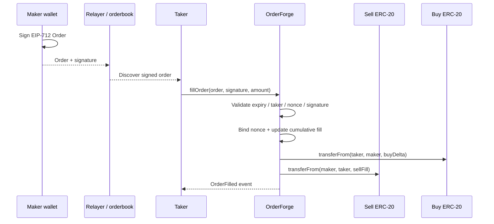

# Architecture

## Goal

OrderForge separates **off-chain intent creation** from **on-chain authorization and settlement**. A maker signs an EIP-712 `Order`; any permitted taker can submit the signed order and choose a partial sell amount. The contract verifies the signature, replay state and fill bounds, then atomically transfers the proportional token amounts between participants.

## Trust boundaries

### Off-chain
The orderbook or relayer is untrusted. It may hide, reorder or submit signed orders, but it cannot change a field without invalidating the signature.

### Maker
The maker controls the signing key and sell-token allowance. Cancellation can target a specific typed order, while nonce invalidation disables the entire nonce slot.

### Taker
A public order can be filled by any caller. `allowedTaker` restricts execution to one address when required.

### Tokens
OrderForge assumes conventional ERC-20 behavior. The project deliberately does not claim support for fee-on-transfer, rebasing or adversarial tokens.

## Nonce binding

A nonce is bound to the first valid order hash that is partially filled. Later partial fills must use that exact digest. This prevents two differently signed orders that accidentally share a maker nonce from both becoming active.

A fully filled order invalidates its nonce. A maker may also invalidate a nonce before or after a partial fill to block further settlement.

## Partial-fill arithmetic

For cumulative sell fill `x`, the maker must have cumulatively received:

`ceil(x * buyAmount / sellAmount)`

Each fill charges the difference between the new and previous cumulative target. This avoids repeated rounding drift and guarantees that a completely filled order pays exactly `buyAmount`. With extremely low-decimal assets, smallest-unit rounding dust can be redistributed between successive takers. A partial fill whose cumulative delta would require zero buy-token units is rejected, and real integrations should still enforce economically sensible minimum fill sizes.

## No protocol custody

Transfers settle directly between maker and taker. The contract should end every successful settlement with zero balance of both assets; the invariant suite continuously checks this property.
